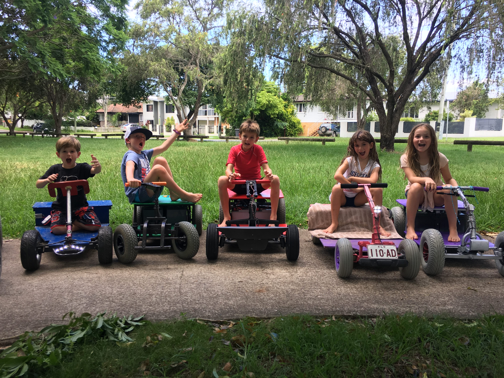

{:class="img-responsive"}

Cruisin Co was started by Nathan Aherne, this is his account of how Cruisin Co came to be:

What was to become Cruisin Co started when I found an old electric Powerwheels trike on the side of the road. I picked it up because I wanted the motor for another project I was working on but when I got it home, my son and daughter wanted it. I had purchased them electric toys previously but they were always lacking. This trike was very well loved and it needed a new seat and a battery. I built a new seat and then installed a 12v lithium polymer battery from one of my remote control planes. As soon as the kids drove it, they loved it, that thing could drift (on the tiles inside) like no ones business. My kids, now excited from the fun that comes with an electric vehicle that drives like a rally car, wanted more speed and power.

I purchased a large plastic quad bike (below) from [Gumtree](https://www.gumtree.com.au) for $40 and set about replacing the electronics and drive train. I spent approximately 3 months of my spare time and $500 on new components.  I replaced or installed the following:

1. I replaced the stock 12v lead acid battery with 4 x [Headway LiFePO4 batteries](http://www.evworks.com.au/headway-38120-10ah-cell-lifepo4-cell-3.2v-10ah) wired in series with a [4s BMS](https://bmsbattery.com/185-thickbox_default/4s-lifepo4-bms-for-4-cells-in-series-battery.jpg) which I had been using in a robotics project.
2. [Dimension Engineering Syren50 motor controller](https://www.dimensionengineering.com/products/syren50)
3. [200w 12v worm drive gear motor](https://www.motiondynamics.com.au/worm-drive-motor-12v-24v-200w-180-rpm-20nm-torque.html)
4. I machined a custom drive shaft to fit the gear motor and custom hubs to drive the wheels.
5. Installed lighting in all the areas where it could fit
6. Reinforced the frame of the quad bike to make it more rigid



I gave it to my son and daughter and they loved it. It had power and speed and it could go anywhere. A month or so after I gave it to them, we took it camping at [Gordon Country](https://www.gordoncountry.com.au/). My son drove it for about 2 hours until he decided that the easiest way to do a burnout was to drive it into a tree and hold the throttle on.... The motor proceeded to turn the drive shaft into spaghetti and that was the end of the quad. In hindsight, I should have known that would happen.

A few months after the quad died, I decided to have a crack at modifying a PowerWheels car. I had come across the [Modified PowerWheels site](http://www.modifiedpowerwheels.com/) while modifying the quad bike and was excited to see the great results they were getting there. I purchased 2 (of the below) PowerWheels buggies from [Gumtree](https://www.gumtree.com.au) and set about doubling the voltage from 12v to 24v. In the end I only modified one of them.

The cars were definitely fun to drive but I could see that the drive train wasn't going to last long. I spoke with my son and daughter and we decided to sell them to someone else on the basis that I would build them something better. For the next 6 months the kids reminded me weekly that I needed to build them a car.



Now the pressure was on, I needed to build something faster and stronger than I had built or seen previously. I purchased the plans for the [Toylander](https://www.toylander.com/) and started planning out how I would build one. The [Toylander](https://www.toylander.com/) is a fantastic car, the gold standard in children's electric cars (excluding those crazy expensive ones). I got as far as planning out the cost in time and money before I realised it wasn't feasible. My kids would at some point, want a [Toylander](https://www.toylander.com/) of their own, and I didn't have the time to make two of them.

A few months after giving up on the Toylander idea, I stumbled across an old Pride mobility scooter that had been reduced to its front and rear wheels (with motor). I spent the next 3 months turning it into a car for my sons birthday (in June), which you can see below.

I used all of the left over components from the quad bike I had made earlier, so the dollar cost wasn't too high.



As soon as my daughter drove it, she wanted one of her own. Luckily my son is a great sharer, so she was content to share with him until her birthday. I had until September to get it done and decided that I would prefer something a little smaller so I could easily fit it in the boot of the car (my son's car fits, it is just a bit awkward getting it in). I bought an old pedal car and set about turning it into an electric car over the next few months. The motor that I needed didn't come in until 3 weeks before her birthday and try as I might over those 21 days, I could not stop the chain from slipping. 48 hours before her birthday (and birthday party) I accepted that it wasn't going to work and went back to what I knew. I bought an old mobility scooter and spent the next 48 hours building the car, baking 36 muffins for her school friends, baking a fancy fondant cake covered in flowers and organizing an 8 year old's birthday. Not much sleep was had in those 48 hours but the car came out fantastic.

The car on the left is the pedal car I failed to turn into an electric car and on the right is the mobility scooter car I made for her in 48 hours.



Once the kids in the neighborhood realized that the electric car wasn't a one off, they all wanted one too. For Christmas 2017, I made 5 more cars for the kids in our neighborhood. While building them, I included the parents of the children who were getting them for Christmas, which was a great experience for them. It also made the cars that much more special for their children.

While I was building these 5 cars, I decided to build a custom computer and software to control the cars. One request the children had made, before I started building these cars, was cruise control, which wasn't possible without a computer and custom software. After I wrote the software, [I made it available to everyone for free](https://github.com/nathanaherne/cruisin), I also submitted a reddit article detailing the build of the cars. I thought that this would be enough to help others to build these cars....



As you could imagine, 7 electric cars in one neighborhood, draws the attention of both adults and children. All the kids driving with us to coffee through the local park was like a giant electric car conga line. Over the course of the next 6 months many adults inquired about where they could buy one, if I could show them how to build one or if I would sell them one.

During this time, I started doing [Landmark](https://www.landmarkworldwide.com) and as part of the SELP programme, you need to create a community project. I had considered turning these cars into a community program but had not yet made a decision. On the afternoon that I had to decide, a father asked me if I could help him build one for his son who had club foot.... and this is how Cruisin Co came to be.

