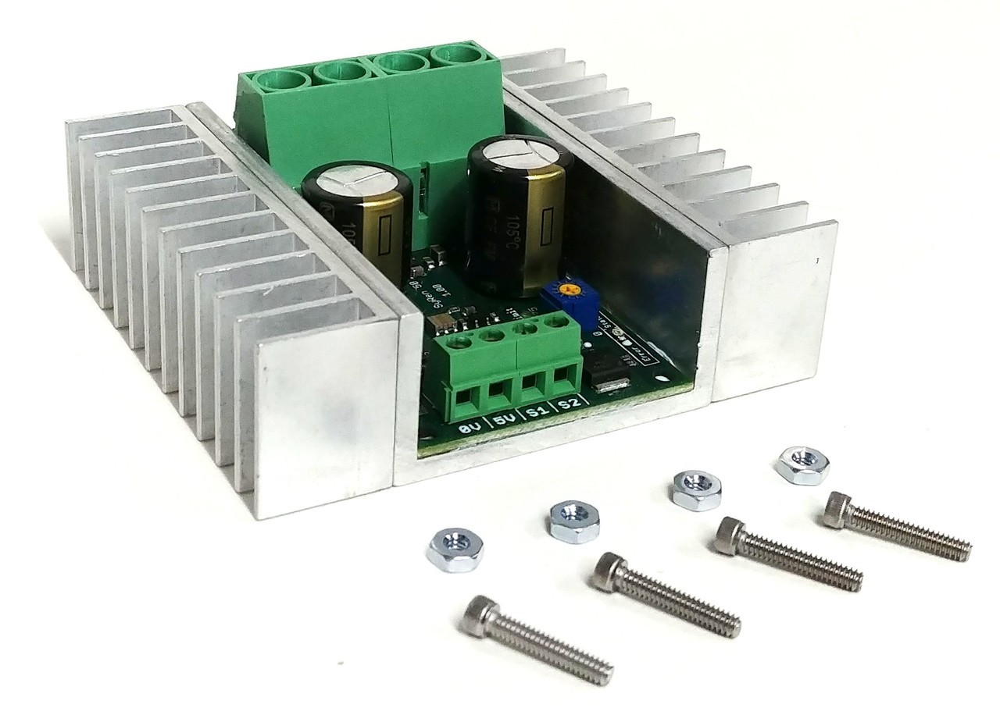

# Electronics

{:class="img-responsive"}

A basic overview of how the electronics system works is:

1. The driver pushes the [forward/reverse buttons](parts-required.md#throttle-control)
2. The [Cruisin Brain](/cruisin/cruisin-brain/index.html) detects the button(s) being pushed.
3. The [Cruisin Brain](/cruisin/cruisin-brain/index.html) converts the button push into a command the motor controller can understand.
4. The [Cruisin Brain](/cruisin/cruisin-brain/index.html) sends the command to the motor controller.
5. The [Motor controller](parts-required.md#motor-contoller) takes power from batteries and uses it to power the electric motor.

This section describes how you should install the electronics to achieve the above. Before you install the electronics, you should plan out, using the information below, where on the car, you will install them.

### Forward/Reverse (buttons)
1. The [forward/reverse buttons](parts-required.md#throttle-control) need to be installed where they are easily accessible for the driver, which is usually the handle bars or steering wheel that will be used to steer the car.
2. You should make sure these parts are securely fastened.
3. You should insulate any exposed wires with tape, hot glue or some other insulating medium.

### Motor Controller
1. The [motor controller](parts-required.md#motor-contoller) should be installed as close to the electric motor and battery(s) as possible. This is usually under the seat.
2. It should be fixed in place so that it cannot move.
3. It should be installed as high as possible to keep it protected from water and dirt.

### Battery(s)
1. The [battery(s)](parts-required.md#battery) should be installed as close to the motor controller as possible. This is usually under the seat.
2. It should be fixed in place so that it cannot move.
3. It should be installed as high as possible to keep it protected from water and dirt.

### Cruisin Brain
1. The [Cruisin Brain](parts-required.md#cruisin-brain) should be installed as close to the motor controller as possible. This is usually under the seat.
2. It should be fixed in place so that it cannot move.
3. It should be installed as high as possible to keep it protected from water and dirt.

### Wiring
1. You will use a number of meters of electrical wiring to join all the components.
2. It should be fixed in place so that it cannot move - we often use zip ties to secure wiring.
3. You should make sure it is not underneath the cars frame just incase the driver scrapes a rock.
4. You should not have any exposed wires but if you do, it should be insulated with tape or other insulating medium.
5. Shrink tubing is good at covering exposed wiring.

### Next section is [Painting](/cruisin/diy/painting-the-car/index.html)

### Previous section is [Priming the frame](/cruisin/diy/priming-frame/index.html)

### [Start Over](/cruisin/diy/index.html)
