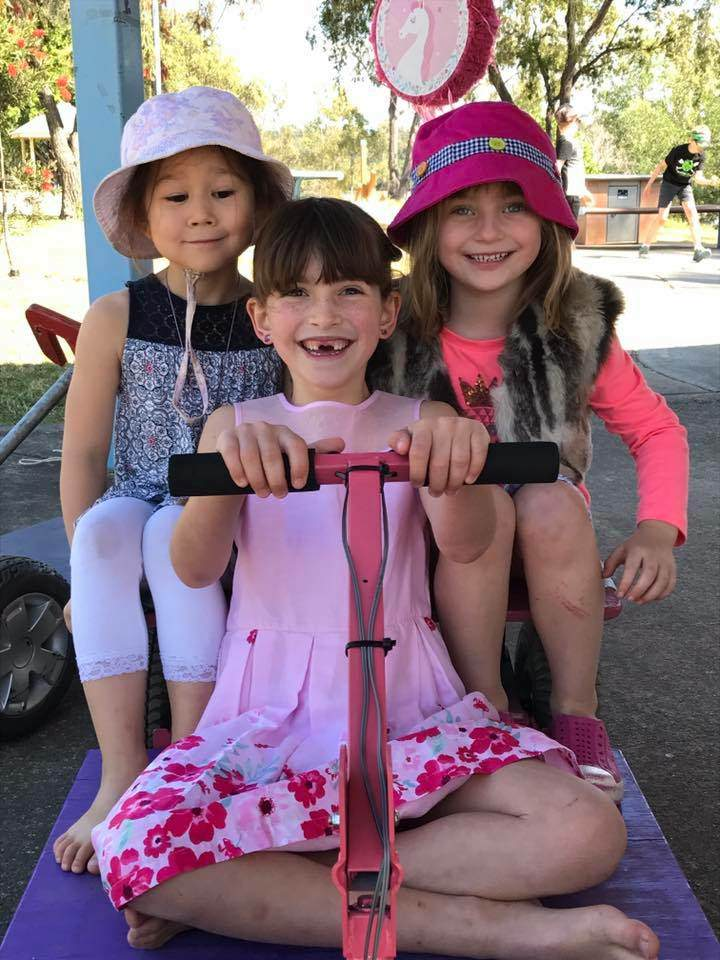

# Finished

{:class="img-responsive"}

Congratulations, your car should now be finished. Your car should look similar to and drive like the car in the below video.



If you would like to build a trailer (like the one in the above video) for your car, [the instructions are available here](/cruisin/diy/trailer/index.html)

If you have any questions, comments or feedback please [contact us](/cruisin/contact/index.html).

### Next section is [Trailer](/cruisin/diy/trailer/index.html)

### Previous section is [Painting](/cruisin/diy/painting-the-car/index.html)

### [Start Over](/cruisin/diy/index.html)