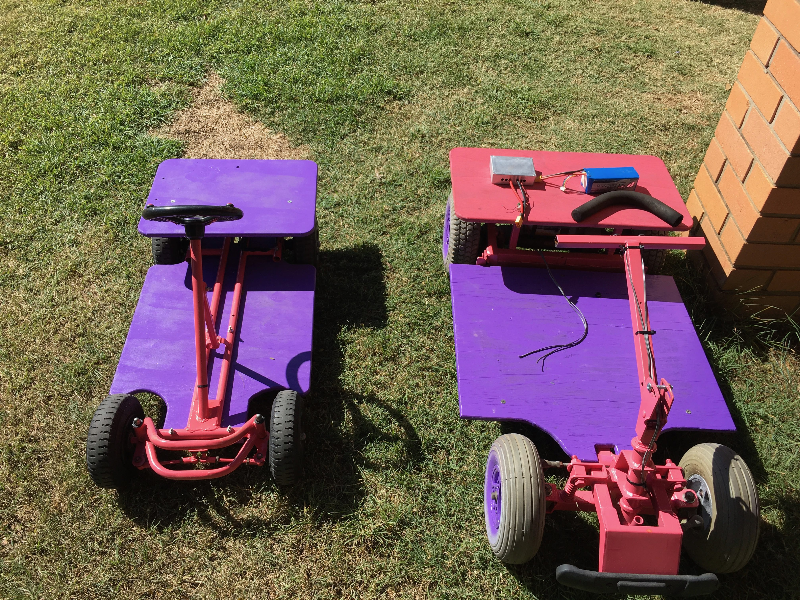

# Painting the car

{:class="img-responsive"}

You can paint the car any way you wish, though you should get paints that are compatible with each other. We regularly use spray paint.

The plywood seat and floor will soak up paint, so it is recommended that you paint it with an undercoat (from a tin) so that you minimise the amount of spray paint you need to use.

You car should look like this

 
 

When you have finished painting, your car should look something like this

 
 

### Next section is [Finished](/cruisin/diy/finished/index.html)

### Previous section is [Electronics](/cruisin/diy/electronics/index.html)

### [Start Over](/cruisin/diy/index.html)