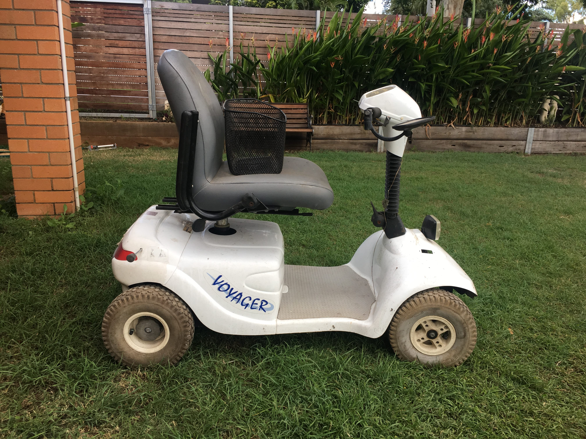

# Parts Required

{:class="img-responsive"}

Below details the parts you will need to buy to build your own Cruisin Co Electric Car.

### Mobility scooter
You will need to find an old mobility scooter, though you can use an electric wheelchair (but they require more effort).

See example mobility scooter above

You can get your mobility scooter from places like [Gumtree](https://www.gumtree.com.au), calling a local mobility scooter retailer, a aged care home or [Ebay](https://www.ebay.com). When you are selecting a mobility scooter, you want to make sure the frame is in good condition and the motor and drive-train works, everything else will probably be replaced during this process. 

The easiest way to tell if the motor and drive train work is to take the mobility scooter for a drive. If your donor mobility scooter is in drivable condition, you onto a winner because it means that not only does the motor and drive train work but that the batteries work, the motor controller works and everything else is in decent mechanical condition. If your mobility scooter comes with a battery charger, your off to a great start.

**You should get the mobility scooter first as it often defines the other parts you need**

### Motor controller
There are a couple of motor controllers we recommend:

**[Spark Motor Controller](http://www.revrobotics.com/rev-11-1200/)**

1. We recommend this simply because it is the cheapest motor controller that suits, though it does lack internal current control.
2. Supports 24v batteries

**[Dimension Engineering Syren50](https://www.dimensionengineering.com/products/syren50)**

1. This motor controller has more features than the Spark Motor controller
2. We have tested this motor controller for several months and it is extremely robust.
2. Supports 24v batteries

**Motor Controller from the mobility scooter**

If you wish to use the motor controller that came with your mobility scooter, you need to use the wigwag that came with your mobility scooter to control forward and reverse (plus several other features the controllers require). If you choose to do this, you should make sure you keep (and not damage) all electrical parts from the original mobility scooter. You will need to replicate (and possibly reverse engineer) much of the electronics system from the mobility scooter. This is unique for each mobility scooter and will not be covered in these instructions. Please keep in mind that you will be unable to use the [Cruisin Brain](/cruisin/cruisin-brain/index.html) in your electric car.

This is what a Wigwag looks like

 
 

These are some examples of motor controllers that come with mobility scooters

 
 

### Battery(s)
The battery voltage you can use in your Cruisin Electric car is limited by the maximum voltage your motor controller accepts. All motor controllers currently supported by the Cruisin Brain support up to 24v, 12v is the minimum recommended. Some future motor controllers will support up to 72 volts.

All mobility scooter motor controllers we have come across require a 24 volt battery system.

**24v sealed lead acid battery**

If your mobility scooter came with working batteries you can use them, wired in series, for 24 volts. You could also purchase two new SLA batteries and use them.

**24v lithium polymer battery**

This is the battery we recommend, for the following reasons:

1. it is small, giving you more floor space. 
2. it can be charged in approximately 1 hour (if your charger can supply 10 amps)

You can run multiple batteries to give you a longer run time. A single one of these batteries will give your Cruisin Co Electric Car, approximately 2 hours of continuous run time.

1. [Multistar 10,000mAh Lipo battery](https://hobbyking.com/en_us/multistar-high-capacity-6s-10000mah-multi-rotor-lipo-pack.html?___store=en_us), couple it with
2. A [BMS](https://bmsbattery.com/bmspcm/330-smart-bms-513-cells-in-series-bms-pcm.html) to protect the battery and make charging simple.

**Battery Charger**

You will need a battery charger for the battery you choose to use. You can buy 24v battery chargers from Ebay quite cheaply.

### Throttle control
Selecting the way you would like forward/reverse to be controlled, defines the parts you will need:

You have several different options for controlling forward/reverse. Push buttons is the recommended way to control the forward/reverse speed as it is the simplest to build and the simplest for the children to use.

In saying the above there are several other options, some of which are below.

1. [Push buttons (momentary switch)](https://www.ebay.com.au/itm/2-5Pcs-6-Colors-12mm-Mini-Round-Switch-Waterproof-Momentary-ON-OFF-Push-Button/282607014565?hash=item41ccb0d2a5:m:m5O7n_sKiZ5Brga9kmG1J-g). You will need two of these but I recommend getting a couple of spares.
2. Electric bike throttle, [Ebay](https://www.ebay.com) is the best place to find these.
3. Foot throttle, [Ebay](https://www.ebay.com) is the best place to find these.
4. [Joystick](https://www.servocity.com/electronics/components/joysticks)

### Wiring
If you are using the push button switches to control forward/reverse (above), you will need to get some [twin core wire (light gauge)](https://www.jaycar.com.au/light-duty-fig-8-speaker-cable-sold-per-metre/p/WB1702). You will need approx 6m of this. This wire is also good for [lighting](parts-required.md#lights).

If you are using the electric bike throttle (or any other device that has 3 wires), we recommend this [three core wire](https://hobbyking.com/en_us/twisted-22awg-servo-wire-1mtr-r-b-y-22awg.html). You will need approximately 6m of this.

[Twin core wire (heavy gauge)](https://www.jaycar.com.au/25a-2-core-tinned-dc-power-cable-sold-per-metre/p/WH3087). This is used to connect the batteries and motor to the motor controller. You will need approx 3 meters of this.

### Plywood
1. [12mm plywood](https://www.bunnings.com.au/ecoply-2400-x-1200-x-12mm-cd-non-structural_p0340315). This is used to make the seat and floor of the vehicle. You will not need a whole sheet.
2. You will need a way to fix the plywood to the frame. We recommend 6mm galvanized bolts. Do not glue the seat and floor plate on as you may need to remove them at some point.

### Cruisin Brain
The Cruisin Brain is a combination of software (that we have written) and off the shelf hardware which when combined together, creates the Cruisin Brain.

Building the Cruisin Brain is probably the most complex part of creating a Cruisin Electric Car, especially if you have not used Arduino or microcontrollers before. We have started work on creating a ready made Cruisin Brain (that you can buy) so that you do not need to build your own.

[There is detailed information on the Cruisin Brain available here](/cruisin/cruisin-brain/index.html)

### Lights
You can add extra awesome to your electric car by adding lights.

We recommend 12v LED lights coupled with a voltage regulator that outputs 12v and supports the voltage your [battery(s)](index.html#battery(s)) supply. You can wire the lights so they turn on when the car is turned on, or wire them to a switch that turns them on. For simplicity we often wire the lights so they turn on when the car is on. The [twin core wire above](index.html#wiring) is good for wiring up the LED lights.

Future versions of the [Cruisin Brain](/cruisin/cruisin-brain/index.html) will (along with other features) support headlights, brake lights and indicator lights.

### Other things you will need
1. Metal primer paint for any spots that have bare metal
2. Paint for metal and wood to make your new car look awesome
3. 20mm square steel tube to create the structure for the seat
3. 20mm square steel tube or round tube (depending on your throttle control choice), [see here for more details](/cruisin/diy/steering/index.html)
4. Standard bicycle grips for the steering bars

### Next section is [Strip Mobility Scooter](/cruisin/diy/strip-mobility-scooter/index.html)

### Previous section is [Tools Required](/cruisin/diy/tools-required/index.html)

### [Start over](/cruisin/diy/tools-required/index.html)