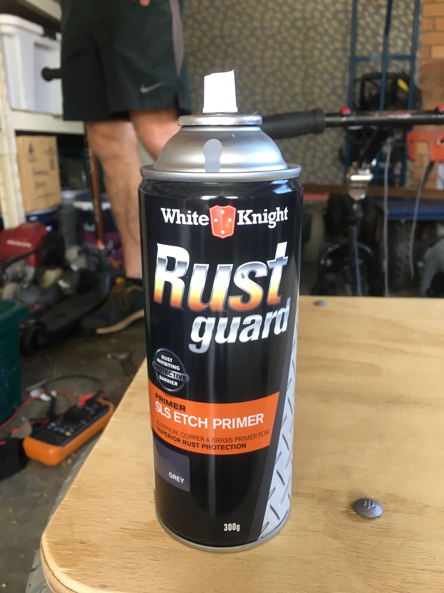
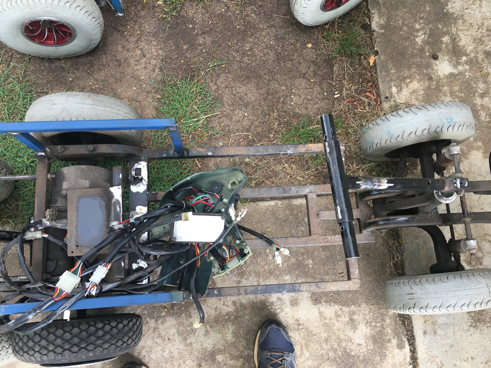

# Priming the frame

{:class="img-responsive"}

# Painting any raw steel

Now that you have the frame for the seat done, removed any excess metal parts and have the steering done, you should clean up any remaining welds, sharp edges and rust to prepare the frame for painting with a metal primer. You can choose not to paint the welds and raw metal but those areas will rust.

We regularly use White Knight SLS Etch Primer to paint any raw metal and welds. It has worked very well.



The car (it isn't a mobility scooter anymore) below has just had its seat frame welded in, its steering column and handle bars welded and any rusty or excess metal removed.

{:class="img-responsive"}

### Next section is [Electronics](/cruisin/diy/electronics/index.html)

### Previous section is [Cleaning the frame](/cruisin/diy/cleaning-frame/index.html)

### [Start Over](/cruisin/diy/index.html)