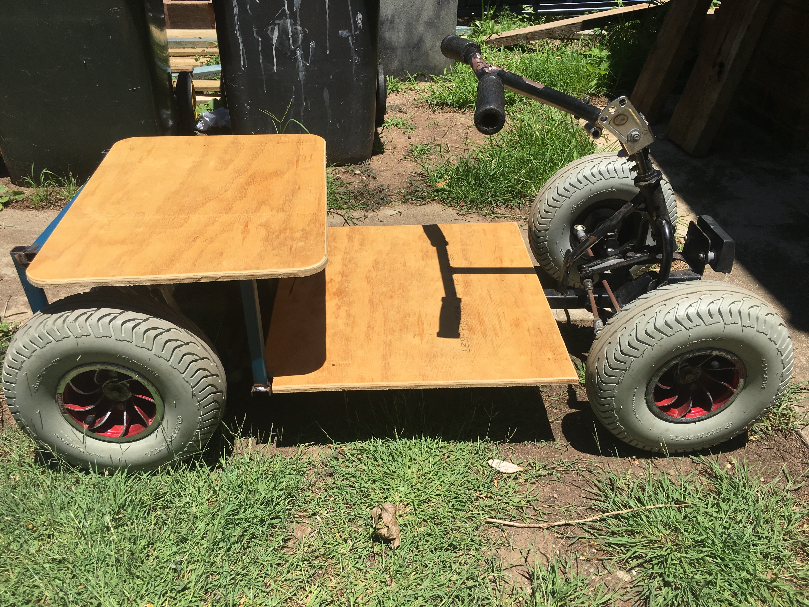

# Seat and floor plate

{:class="img-responsive"}

Now it's time to make a floor plate and seat for the car. We recommend [12mm plywood](parts-required.md#plywood) as it is good balance between strength and weight. We recommend a 30mm overhang over any of the steel frame (except over the wheels, where the seat extends over them entirely) so that little fingers have something to hold onto. You should attach the plywood with 6mm bolts.



In the below photo below, the seat and floor plate are not attached to the car. Once the seat and floor plate are the correct size, bolt them in place.



**You might find yourself wanting to paint the plywood and vehicle at this point but it is best if you wait until you have completed everything before painting the plywood or vehicle**

### Next section is [Cleaning frame](/cruisin/diy/cleanup-frame/index.html)

### Previous section is [Strip Mobility Scooter](/cruisin/diy/strip-mobility-scooter/index.html)

### [Start Over](/cruisin/diy/index.html)