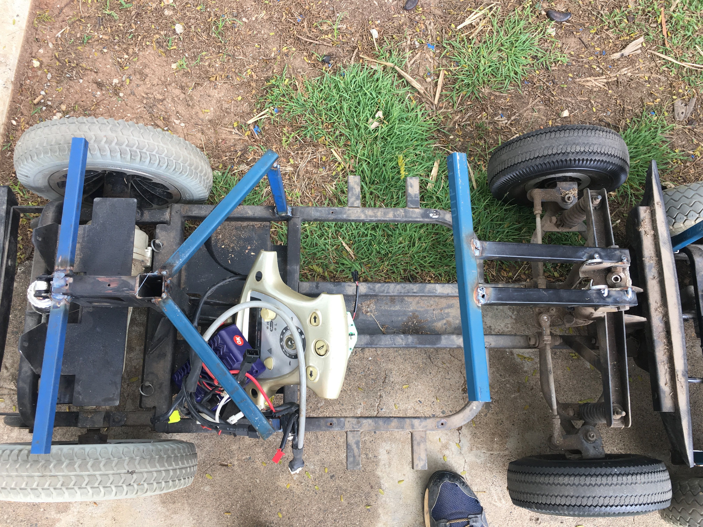

# Seat Frame

{:class="img-responsive"}

Now it is time to make the frame for the seat. We recommend 20mm square tube (non galvanised as welding galvanised steel creates toxic fumes), cut it to the required length/shape and then weld the pieces together. Each mobility scooter is different, so there is no formula for doing this as each mobility scooter requires a slightly different configuration. You just want to make up a frame that will support the seat. It is important to make sure the seat will be higher than the rear wheels.

You should also consider the [batteries](parts-required.md#battery-and-bms) you are going to use in the car and where you will mount the [motor controller](parts-required.md#motor-controller) when building the seat frame. The seat frame should completely cover the [motor controller](parts-required.md#motor-controller) and [batteries](parts-required.md#battery-and-bms).

You will notice the steel plates underneath the seat frame in the photo below. This particular car used the batteries that came with the mobility scooter, so they made the seat frame so it covered the existing battery mounts on the mobility scooter.



### Examples
Below are 3 more examples of what your seat frame could look like. You will notice that each of the below examples is different, as each mobility scooter is slightly different.

{:class="img-responsive"}

{:class="img-responsive"}

{:class="img-responsive"}

### Next section is [Steering](/cruisin/diy/steering/index.html)

### Previous section is [Strip the mobility scooter](/cruisin/diy/strip-mobility-scooter/index.html)

### [Start Over](/cruisin/diy/index.html)