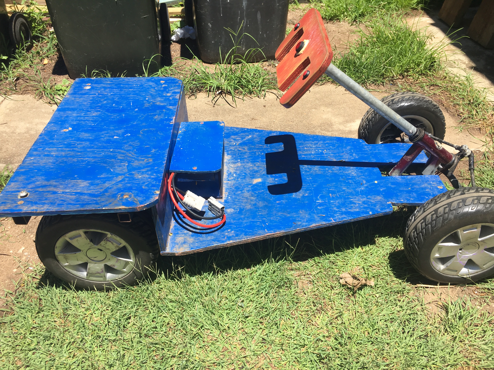

# Steering

{:class="img-responsive"}

The mobility scooter might have a steering column that is too long or too short. If it is too long, cut it to the required length and weld on a horizontal piece of 20mm square tube, if it is too short, extend it and weld on a piece of horizontal steel. 

In the photo below, the original handle bars were removed, the steering column was cut to a suitable length and the original handle bars were welded back on.



In the photo below, the original handle bars were removed, the steering column was cut to a suitable length and a piece of 20mm square steel tube (the same steel tube used for the seat frame) was welded as handle bars.



In the photo below, the steering column was cut to length and a steering wheel was made from plywood to steer the car.


### Electric bike throttle
If you wish to use an electric bike throttle, you will need to use round tubing to suit the throttle.

### Next section is [Seat & floor plate](/cruisin/diy/seat-floor/index.html)

### Previous section is [Seat Frame](/cruisin/diy/seat-frame/index.html)

### [Start Over](/cruisin/diy/index.html)