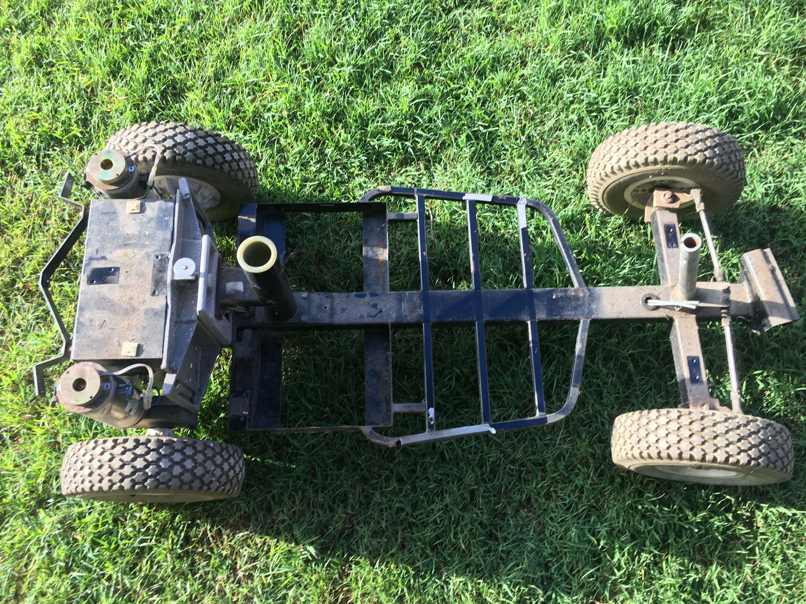

# Strip the mobility scooter

{:class="img-responsive"}

In this section, we will show you how to strip your mobility scooter. The end goal is to strip everything from the mobility scooter until you have the basic metal frame with motors, wheels and steering still attached.





### Step 1 - Remove easy to strip parts

This step is where you remove any parts which can be easily removed by hand. For this particular mobility scooter, the seat and battery covers were the parts I could remove without tools.



### Step 2

Now you can start removing the harder to remove stuff. I usually use an angle grinder to remove the parts of the shell. Don't forget to use safety equipment when using an angle grinder.

In the photo below, the batteries, rear cover and top cover on the handle bars have been removed. All of the electronics are still in the vehicle. Most mobility scooters have electronics in the steering and near the rear wheels, with some cables connecting them together.

 
 

After a little bit of work, you should have something like this, if you look closely you will notice the electronics are still in the rear of the mobility scooter. You will also be able to see the gray cable that connected the electronics in the steering with the electronics at the rear.

 
 

### Step 3

Now that you can get to the electrical wiring, you can remove it. 

1. If you want to use the motor controller that came with the mobility scooter you should remove the electronics carefully and take photos of the process, so that you can connect it back together. 
2. If you are using the [Cruisin Brain](/cruisin/cruisin-brain/index.html) and one of the [recommended motor controllers](parts-required.md#motor-controller), damaging the electronics isn't an issue. 

Keep in mind that in both cases you should not damage the wires coming out of the motor(s).

Removing the electronics from the rear black box

 
 

All the electronics (except motors) removed.

 
 

**You have finished stripping the mobility scooter**

### Next section is [Seat Frame](/cruisin/diy/seat-frame/index.html)

### Previous section is [Parts Required](/cruisin/diy/parts-required/index.html)

### [Start over](/cruisin/diy/tools-required/index.html)

