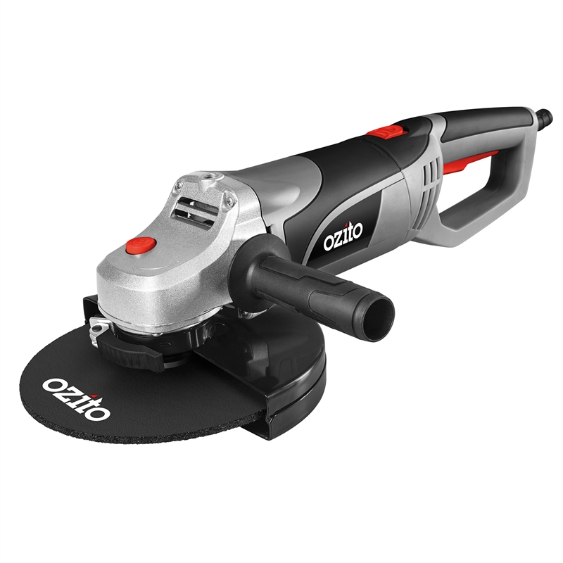

# Tools required

{:class="img-responsive"}

Turning a mobility scooter into a Cruisin Electric car does not take many tools. I am a fan of using powertools where possible because they make the job quicker. You will need the following tools to complete the job.

1. Grinder with cutoff disk and grinding disk
2. A Welder
3. A way to cut 20mm square steel pipe (you could use the grinder)
4. Electric Drill with 6.5mm drill bit
5. A way to cut sheets of 12mm plywood
6. Measuring tape
7. Soldering iron and solder

You will probably need other things like a pencil, spirit level, screw drivers, spanners, allen keys etc.

If you do not have some of the power tools above, this project might be a good excuse to buy them :-)

### Next section is [Parts required](/cruisin/diy/parts-required/index.html)

### Previous section is [Build Overview](/cruisin/diy/build-overview/index.html)

### [Start Over](/cruisin/diy/index.html)