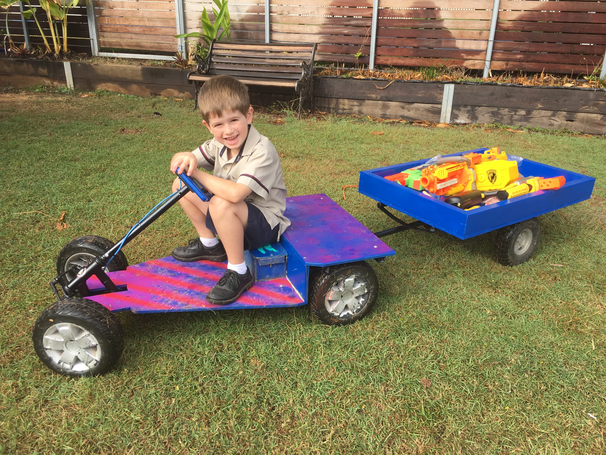

# Trailer

{:class="img-responsive"}

No electric car is complete without a trailer (in my kids minds at least). This page details how to make a trailer for your electric car from off the shelf components.

The trailer starts off with a $20 hand trolley from [Bunnings](https://www.bunnings.com.au/250kg-p-handle-trolley-with-pneumatic-tyres_p2972045) or your local hardware retailer. 

The trolley looks like the below photo.

 
 

Once you have your trolley, you will need to remove the bottom plate and part of the top of it, so it looks like the below photo. You will notice the grey paint, [it is the same metal primer used for the car](/cruisin/diy/priming-the-frame/index.html)

 
 

Once your trolley looks like the above, you are ready to start making it look like a trailer. Cut out a piece of 12mm plywood that is approximately 640mm x 900mm, this will form the base of your trailer. Once you have the base cutout, you can add sides to the trailer base, 90mm x 35mm pine is a good size for this. To fix the sides to the base I use wood screws and water proof polyethylene glue.

 
 

Flip the trailer and the frame upside down and fix the trailer base (with sides) to the steel frame of the trolley using 6mm galvanized bolts. At this point you do not want the attachment to be permanent because you will want to paint the trailer frame and base.

 
 

Prime the wood tray of the trailer

 
 

Paint the primed trailer whatever color you like

 
 

Drill hole in the arm of the trailer (just big enough to fit the threaded rod below) which will become the hitch point

 
 

Bend a piece of 10mm galvanised threaded rod so it has a 90 degree bend in it. Drill a 10mm hole in the rear steel frame of the car and install the bent threaded rod so it is pointing downwards (for safety).

 
 

You should now have a trailer that looks just like this

 
 

### Previous section is [Finished](/cruisin/diy/finished/index.html)

### [Start Over](/cruisin/diy/index.html)